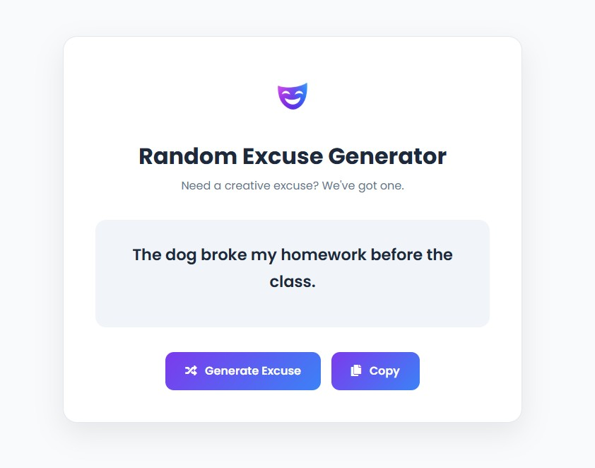

# Random Excuse Generator

[](https://developer.mozilla.org/en-US/docs/Web/HTML)
[](https://developer.mozilla.org/en-US/docs/Web/CSS)
[](https://developer.mozilla.org/en-US/docs/Web/JavaScript)
[](https://getbootstrap.com/)

A modern web application built with **Vanilla JavaScript** that dynamically generates random excuses through DOM manipulation and event-driven programming.

The project focuses on writing clean, maintainable JavaScript while creating a polished and responsive user interface using modern frontend development practices.

---

## Preview



---

## Features

- Generate unlimited random excuses
- Copy generated excuses to the clipboard
- Responsive user interface
- Dynamic content updates without page reload
- Modern UI with reusable styling
- Clean and maintainable JavaScript code

---

## Tech Stack

### Frontend

- HTML5
- CSS3
- Vanilla JavaScript (ES6+)
- Bootstrap 5
- Font Awesome

---

## Project Structure

```text
src/
│
├── assets/
│   └── img/
│       ├── logo.png
│       └── favicon.png
│
├── app.js
├── style.css
└── index.html

docs/
└── screenshots/
    └── home.png
```

---

## Getting Started

### Prerequisites

- Node.js
- npm

### Installation

```bash
# Clone the repository
git clone https://github.com/meylin103/random-excuse-generator.git

# Navigate to the project
cd random-excuse-generator

# Install dependencies
npm install

# Start the development server
npm run start
```


## How It Works

Every time the user clicks the **Generate Another Excuse** button, JavaScript randomly selects one value from each of four arrays:

- Who
- Action
- What
- When

The selected values are combined into a complete sentence and rendered dynamically without reloading the page.

---

## Skills Demonstrated

- DOM Manipulation
- Event Handling
- JavaScript Functions
- Array Manipulation
- Bootstrap Integration
- Clipboard API
- Clean Code Principles

---

## Roadmap

- [ ] Add Dark Mode
- [ ] Save favorite excuses
- [ ] Display excuse history
- [ ] Support multiple languages
- [ ] Add custom excuse categories
- [ ] Share excuses directly to social media

---

## Author

**Meilyn Fuentes**

AWS Certified Cloud Practitioner

Full Stack Developer

Cloud & Backend Enthusiast

- GitHub: https://github.com/meylin103
- LinkedIn: https://www.linkedin.com/in/meilynfuentes